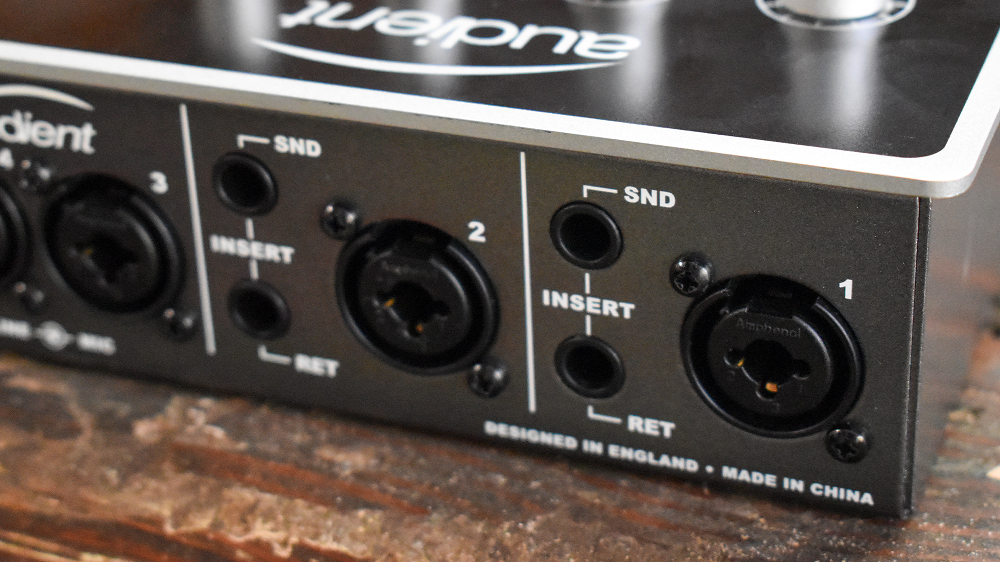

+++
title = 'How to Add More Inputs to an Audio Interface'
date = 2024-02-12 
+++

# How to Add More Inputs to an Audio Interface

***This article was originally published at [How-To Geek](https://www.howtogeek.com/how-to-add-more-inputs-to-an-audio-interface/).***

As you get deeper into podcasting, music recording, or voiceover work, you may find that your audio interface doesn't have enough inputs. Thankfully, you don't need to buy a brand-new interface. You can simply add new channels to the audio interface you already own. 

## Connect an External Preamp to Your Interface via ADAT 

Look at the rear of your audio interface. If you see an optical audio jack (pictured below), your interface is capable of running an additional 8 or 16 audio channels. All you need is an ADAT-compatible preamp unit, such as the [Focusrite Scarlett OctoPre](https://www.amazon.com/Focusrite-Scarlett-OctoPre-8-Channel-Expansion/dp/B01MTY1VMK?tag=hotoge-20&ascsubtag=UUhtgUeUpU2001769&asc_refurl=https%3A%2F%2Fwww.howtogeek.com%2Fhow-to-add-more-inputs-to-an-audio-interface%2F&asc_campaign=Evergreen) or [Behringer ADA8200](https://www.amazon.com/Behringer-ADA8200-BEHRINGER-Black/dp/B00E87OLFQ/?tag=hotoge-20&ascsubtag=UUhtgUeUpU2001769&asc_refurl=https%3A%2F%2Fwww.howtogeek.com%2Fhow-to-add-more-inputs-to-an-audio-interface%2F&asc_campaign=Evergreen). These products are specifically designed for audio interface expansion---ADAT isn't some hack or workaround; it's the "official" way to add channels to your interface. 

The ADAT expansion system can carry eight channels of 24-bit audio at 44.1kHz or 48kHz resolution. As a result, the average ADAT preamp unit has eight discreet inputs for microphone and line-level signals. Budget and mid-range audio interfaces usually have a single ADAT input for eight-channel expansion. However, if your audio interface has a pair of ADAT inputs, you can buy two preamp units for 16-channel expansion. 

If you *need* to record at 88.2kHz or 96kHz, an ADAT cable will only carry four audio channels. Most eight-channel preamps, barring some of the cheaper options, have two ADAT outputs to circumvent this limitation. But, if you want to take advantage of such a setup, you'll need an audio interface with two ADAT inputs. In any case, you probably don't need to record at 88.2kHz or 96kHz. 

Setting up an external preamp is a semi-painless task. You'll need a [digital optical cable](https://www.amazon.com/Optical-Braided-Digital-Toslink-Compatible/dp/B091GNS8ML?tag=hotoge-20&ascsubtag=UUhtgUeUpU2001769&asc_refurl=https%3A%2F%2Fwww.howtogeek.com%2Fhow-to-add-more-inputs-to-an-audio-interface%2F&asc_campaign=Evergreen) to facilitate the ADAT connection. If your preamp doesn't come with a digital optical cable, buy a cheap one—cable quality has no impact on a *digital* signal. Once everything's hooked up, set the preamp to the same sample rate as your interface. Then, open your audio interface's software control panel, set its clock source to "ADAT," and activate its digital audio channels. Check the owner's manual if additional instructions are needed. 

Inexpensive eight-channel preamps like the aforementioned [Behringer ADA8200](https://www.amazon.com/Behringer-ADA8200-BEHRINGER-Black/dp/B00E87OLFQ/?tag=hotoge-20&ascsubtag=UUhtgUeUpU2001769&asc_refurl=https%3A%2F%2Fwww.howtogeek.com%2Fhow-to-add-more-inputs-to-an-audio-interface%2F&asc_campaign=Evergreen)cost about $250 and have a great "transparent" sound. A mid-range option like the [Focusrite Scarlett OctoPre](https://www.amazon.com/Focusrite-Scarlett-OctoPre-8-Channel-Expansion/dp/B01MTY1VMK?tag=hotoge-20&ascsubtag=UUhtgUeUpU2001769&asc_refurl=https%3A%2F%2Fwww.howtogeek.com%2Fhow-to-add-more-inputs-to-an-audio-interface%2F&asc_campaign=Evergreen) or [Audient Evo SP8](https://www.sweetwater.com/store/detail/EVOSP8--audient-evo-sp8-smart-preamp) gives you a much better build quality (which dictates the product's lifespan), plus an expanded I/O and some other handy features. 

If you're concerned about sound quality, don't be. All modern eight-channel preamps sound good, and everything below $1,000 sounds identical, at least from a practical standpoint. Microphone quality and your ability to properly record an audio source are far more important than whatever magic fairy dust is in your interface. 

## Combine Two Audio Interfaces

 

Instead of buying something new, try using what you already own. Two audio interfaces can be used simultaneously. It's a bit of a tricky process, and you shouldn't buy an extra audio interface for this purpose, but it's a good option for those who happen to own extra gear. 

Most mid-range and high-end audio interfaces have a "standalone" operation mode. When in standalone mode, an interface doesn't need to be plugged into a computer. Also, importantly, it will output multichannel audio over ADAT. You just need a [digital optical cable](http://www.amazon.com/Optical-Braided-Digital-Toslink-Compatible/dp/B091GNS8ML?tag=hotoge-20&ascsubtag=UUhtgUeUpU2001769&asc_refurl=https%3A%2F%2Fwww.howtogeek.com%2Fhow-to-add-more-inputs-to-an-audio-interface%2F&asc_campaign=Evergreen) to connect your two interfaces. 

Setting an audio interface to standalone mode is a fairly easy task. The owner's manual will detail this process, but you can usually activate standalone mode from the "routing" section of your audio interface's software controller. Make sure that both interfaces are set to the same sample rate, and set the clock source of your primary interface to "ADAT." You may also need to dig through the routing options of your primary interface, as the expanded channel selection may be disabled by default. 

Note that some audio interfaces do not support standalone operation. A great example is the [Behringer U-PHORIA UMC1820](https://www.amazon.com/Behringer-UMC1820-Audiophile-Interface-Preamplifiers/dp/B01EXI8Y9S?tag=hotoge-20&ascsubtag=UUhtgUeUpU2001769&asc_refurl=https%3A%2F%2Fwww.howtogeek.com%2Fhow-to-add-more-inputs-to-an-audio-interface%2F&asc_campaign=Evergreen), which has an ADAT output but cannot operate as a standalone unit. Read the manual, check the manufacturers' website, or do some Googling to figure it out. 

If neither of your audio interfaces support standalone mode, you'll have to rely on aggregation. Basically, both of the interfaces will be plugged into your computer, but they'll operate under a single audio device. Aggregation isn't ideal in situations that require live monitoring, as it greatly increases the latency of your audio system. Mac computers natively support aggregation, and Apple has a [comprehensive guide](http://support.apple.com/en-us/102171) on the subject. Windows users need to set up aggregation in the third-party [ASIO4ALL](https://asio4all.org/device-aggregation/) driver. 

## Plug a Mixer Into Your Audio Interface 

If you can't afford an external preamp unit, a desktop mixer is your next best option. Mixers are typically used to control live sound---they have multiple audio inputs (usually between 6 and 16), each with dedicated controls for volume, equalization, and effects. These inputs are summed down to a stereo output, which you can plug into your audio interface's microphone or instrument jacks. 

Unfortunately, there's a major downside to this setup. A mixer can't add discreet channels to your audio interface. Even if your mixer has 10 inputs, everything must be summed down to the left and right stereo channels, which will occupy two of your interface's inputs. 

This limitation may be negligible in "studio" settings where you're recording one thing at a time. In other words, you can have all of your microphones or instruments hooked up to the mixer and simply mute the channels that aren't in use. 

But if you're simultaneously recording multiple audio sources, a mixer isn't ideal. Everything that goes into the mixer will be combined and baked down to a stereo audio track on your computer. You'll have a hard time getting professional results, as you won't be able to go back and edit each individual microphone or instrument. 

Mixers are cheap. The [Pyle six-channel mixer](https://www.amazon.com/Professional-Audio-Mixer-Controller-6-Channel/dp/B08BWRW5SL/?tag=hotoge-20&ascsubtag=UUhtgUeUpU2001769&asc_refurl=https%3A%2F%2Fwww.howtogeek.com%2Fhow-to-add-more-inputs-to-an-audio-interface%2F&asc_campaign=Evergreen) regularly goes on sale for under $100, and [Yamaha's 12-channel mixer](https://www.amazon.com/Yamaha-MG12XU-12-Input-4-Bus-Effects/dp/B00I0Q8IX2/?tag=hotoge-20&ascsubtag=UUhtgUeUpU2001769&asc_refurl=https%3A%2F%2Fwww.howtogeek.com%2Fhow-to-add-more-inputs-to-an-audio-interface%2F&asc_campaign=Evergreen) floats around the $400 range. Be sure to check Facebook Marketplace, as there are plenty of mixers on the secondhand market. If you only need instrument inputs, check out the [Franklin SS-6](https://franklinaud.io/products/ss-6-stereo-input-switcher-direct-box)switchable DI box, as it's far more compact than a mixer and may resolve signal noise or ground loop issues. 

Note that some mixers, such as the [TASCAM Model 12](https://www.sweetwater.com/store/detail/Model12--tascam-model-12-mixer-interface-recorder-controller), can operate as both a standalone mixer and multichannel audio interface. A mixer with this functionality may replace your audio interface or act as an aggregate device when you need extra channels. And, in case you're wondering, some high-end mixers *do* include multichannel ADAT output, but they're several times more expensive than standalone ADAT preamp units. 