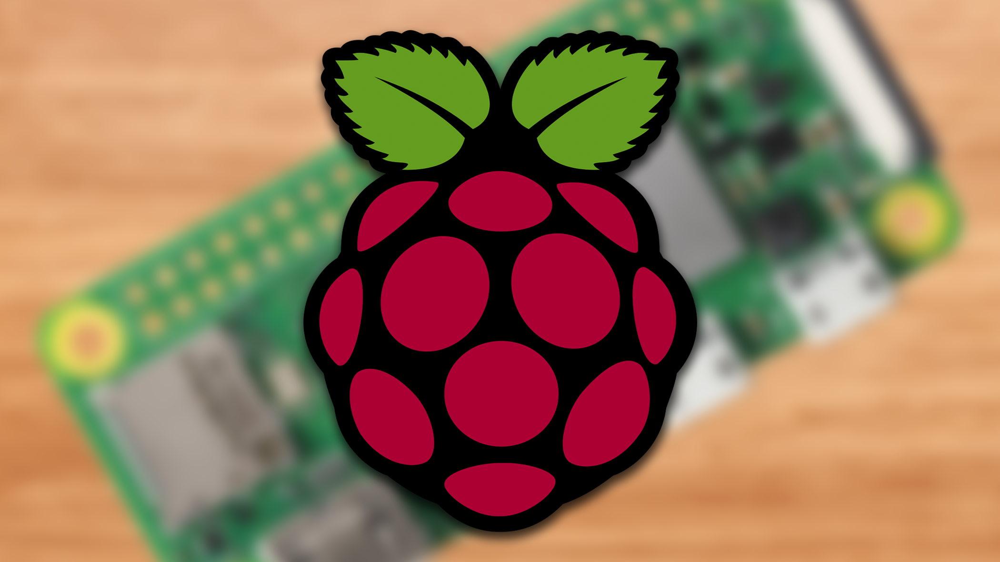
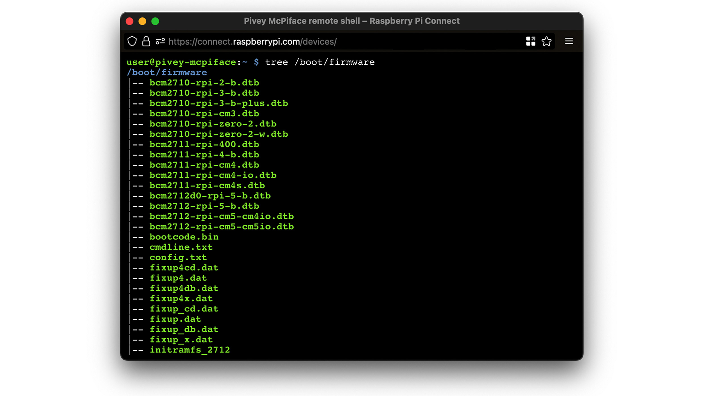

+++
title = 'Raspberry Pi Connect Now Supports All Pi Models'
date = 2024-06-26 
+++

# Raspberry Pi's Remote Access Tool Now Supports All Pi Models

***This article was originally published at [How-To Geek](https://www.howtogeek.com/raspberry-pi-connect-32bit-support/).***

It's been just over a month since the launch of Raspberry Pi Connect, an official remote access tool that allows you to control your Pi computer from a web browser. Today,  Raspberry Pi Connect is rolling out support for 32-bit Pi computers. The new Connect release also includes a remote shell access feature.

Raspberry Pi Connect was limited to 64-bit Pi computers at launch. In other words, it only worked on the Pi 4, Pi 5, and Pi 400. Newfound 32-bit support brings Connect to *all* models of Pi computer, including the original Raspberry Pi from 2012, the tiny Raspberry Pi Zero, and so on.

There's a big caveat here—remote desktop functionality doesn't work on 32-bit Pi models. If you set up Raspberry Pi Connect with an old 32-bit SBC, you will be limited to remote shell access (which is itself a new feature). This is also true of 64-bit Pi computers that haven't been updated to Pi OS Bookworm, as remote desktop requires a Wayland compositor. (So, a Pi 4 that hasn't been updated to the latest OS version cannot use desktop mirroring.)

I doubt that these limitations will be a "problem." Remote shell access from a terminal window is more convenient and powerful than desktop mirroring. And because 32-bit Pi models are often relegated to headless applications, the lack of desktop mirroring may go unnoticed by most users. You can't mirror a desktop that doesn't exist.

The Raspberry Pi team confirms that advanced Pi Connect functionality, including remote file transfer, are currently in development. I'm surprised that remote file transfer wasn't included at launch, but maybe it doesn't matter, as FireZilla and other FTP applications already fill this role.

You can set up Pi Connect by following the instructions listed in the [Raspberry Pi Documentation](https://www.raspberrypi.com/documentation/services/connect.html). The setup process is incredibly easy and should only take you a few minutes. Note that remote desktop and shell access functionality are still in beta and suffer from [some known issues](https://www.raspberrypi.com/documentation/services/connect.html#known-issues). Also, users may encounter latency when relaying is required, as Pi Connect currently relies on just one TURN relay server.

Source: [The Raspberry Pi Foundation](https://www.raspberrypi.com/news/raspberry-pi-connect-remote-shell-access-and-support-for-older-devices/)